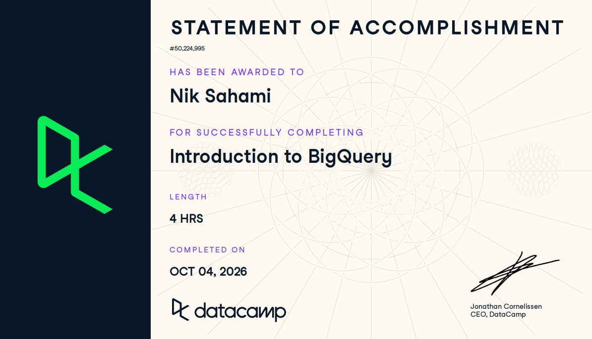

# Course Completion Evidence

Here is my statement of accomplishment for the Introduction to BigQuery DataCamp course.



# Learning Notes and Key Takeaways

## **BigQuery Architecture and Structure**

- BigQuery uses SQL to analyze massive datasets

- Enterprise data warehouse

- Serverless

- it is an OLAP

  - separates the computing and storage

    - We can let BigQuery do the hard work

    - it is like renting space in a shared kitchen

- Snowflake and Amazon Redshift are alternatives for BigQuery

- Different from SQL databases mainly because computing and storage are separate

``` sql
SELECT *
FROM executive_data_file
LIMIT 3;
```

This example was given as a refresher from the previous lecture about how to select all columns and limit to three rows.

BQ Architecture

- Stores data by column instead of row

  - only reads the columns needed

  - makes queries faster

- Capacitor

  - columnar storage format

  - compresses data for faster querying

- Colossus

  - Google’s distributed file system

  - handles storage, replication, and recovery

- Jupiter

  - connects storage and compute

  - moves huge amounts of data quickly

- Dremel

  - runs and organizes queries

  - splits queries into smaller parts

- Borg

  - manages computing resources

  - routes around hardware failures

- Query execution

  - root → mixers → leaf nodes

  - leaf nodes read/filter/aggregate data

  - slots = computing power needed

- Architecture groups

  - Storage = Capacitor + Colossus

  - Compute = Jupiter + Borg

  - Query execution = Dremel

Data Organization

- BigQuery table names have 3 levels

  - Project

    - top-level structure in Google Cloud

    - manages users and permissions

  - Dataset

    - similar to a schema

    - contains tables

    - has its own permissions

  - Table

    - where the actual data is stored

- Full table name = project.dataset.table

- Regions

  - physical Google Cloud data center locations

  - some regions have multiple zones

  - BigQuery also has multi-regions for the US and EU

- Dataset region is permanent once created

  - data can be copied or replicated to another region

  - cannot directly query across different regions

``` sql
# Ex: Modify the code to select the distinct seller_city values from the ecomm_sellers table in the ecommerce dataset.

SELECT DISTINCT seller_city
-- Specify the dataset and table
FROM ecommerce.ecomm_sellers;
```

### For CEP

BigQuery could be useful for my CEP because we may end up working with multiple types of data, like survey data and GA4. Understanding how projects, datasets, and tables are organized would make it easier to keep everything separated and still be able to query it together when needed.

## **Writing queries and data types**

- BigQuery uses normal SQL rules for most queries

  - core SQL commands still work

- Queries can be run through

  - BigQuery Studio

  - client libraries

  - command line

  - Pandas

- Table names

  - full format = `project.dataset.table`

  - if using the default project, can use `dataset.table`

- BigQuery uses GoogleSQL

  - mostly standard SQL

  - some functions and data types are different

- Course uses Olist E-Commerce data

  - Products

    - category, weight, photos, etc

  - Orders

    - includes nested order item data

  - Order details

    - customer/order IDs, status, delivery timestamps

    - null means that stage is not complete

  - Payments

    - payment type, installments, payment value

- Joins + aggregations

  - aggregation function

  - left table

  - right table

  - join condition

    - `ON` if column names differ

    - `USING` if they are the same

  - `GROUP BY` for the grouped result

``` sql
# Ex: Write a query to return the first ten rows of the dataset

-- Add in the operator and integer to complete the query

SELECT 
    *
FROM
    ecommerce.ecomm_order_details
-- Add the syntax to limit the data
LIMIT 10;

# 2: Change the query to select the order_id, customer_id, order_status, and order_purchase_timestamp columns from the order_details dataset for the first 10 rows.

-- Add in the correct columns to the query

SELECT 
    -- Fill in the columns we want to return from our query
    order_id, customer_id, order_status, order_purchase_timestamp
FROM
    ecommerce.ecomm_order_details
LIMIT 10;

# 3: Select the ten smallest orders from the ecommerce.ecomm_payments using SUM on the payment_value column for the first 10 rows of data.

-- Add the correct column and limit values

SELECT
    -- Add the column to calculate the SUM
    order_id, SUM(payment_value)
FROM 
    ecommerce.ecomm_payments
GROUP BY order_id
-- Add the correct column to order
ORDER BY SUM(payment_value)
-- Add the correct number of rows to limit
LIMIT 10;

# 4: Join the ecomm_orders to the ecomm_order_details using the common order_id column.
Order the dataset by order_purchase_timestamp to show the most recent orders

SELECT
    ecomm_orders.order_id,
    ecomm_orders.order_items,
    ecomm_order_details.order_status,
    ecomm_order_details.order_purchase_timestamp
FROM
    ecommerce.ecomm_orders
-- Join on the common order_id column
JOIN 
    ecommerce.ecomm_order_details USING (order_id)
-- Order to show recent orders
ORDER BY order_purchase_timestamp DESC
LIMIT 10;
```

- 3 main ways to batch load data

  - BigQuery Studio

  - `bq` command line

  - `LOAD DATA` in SQL

- BigQuery Studio

  - upload from computer or Google Cloud Storage

  - supported files include CSV, JSON, Avro, ORC, and Parquet

  - choose project, dataset, and table

  - can define schema manually or use autodetect

- `bq` command line

  - can load local files or files from Google Cloud Storage

  - can use flags for file format, schema autodetect, etc

- `LOAD DATA`

  - loads files from Google Cloud Storage only

  - can load multiple files if they have the same schema

  - can specify format and options like skipping the header row

- Main limitation

  - `LOAD DATA` cannot load local files

  - local uploads with Studio or `bq` must be under 100 MB

Date/Time Types in BigQuery

- Dates are useful for

  - filtering large datasets

  - extracting parts like month or day of week

  - partitioning data for faster queries

- `DATE`

  - day, month, and year only

- `TIMESTAMP`

  - exact point in time

  - includes date + time

  - defaults to UTC

- `TIME`

  - time only

- `DATETIME`

  - date + time

  - no required timezone

- Common date/time functions

  - `DATE_ADD` / `TIMESTAMP_ADD`

    - add time

  - `DATE_SUB` / `TIMESTAMP_SUB`

    - subtract time

  - `DATE_DIFF` / `TIMESTAMP_DIFF`

    - find difference between dates/times

  - use `INTERVAL` to define how much to add/subtract

- `EXTRACT`

  - pulls out a specific part

  - ex: day of week, month, year

- `FORMAT`

  - changes how dates/times are displayed

  - useful for making results easier to read

- `CURRENT_DATE()` / `CURRENT_TIMESTAMP()`

  - returns the current date or timestamp

``` sql
# 1: Complete the query to find all the orders on September 15th, 2016. The date string should be in the 'YYYY-MM-DD' format.

-- Finish the query to find sales on 

SELECT
	COUNT(order_id)
FROM
	ecommerce.ecomm_order_details
-- Add the correct date part and date using the correct format
WHERE EXTRACT(DATE from order_purchase_timestamp) = '2016-09-15'

# 2: Find all the orders placed in September by completing the query and counting the order_id.

-- Finish the query to find sales in September 

SELECT
	-- Add the column we want to count by
	COUNT(order_id)
FROM
	ecommerce.ecomm_order_details
-- Add the correct date part and value for September
WHERE EXTRACT(MONTH from order_purchase_timestamp) = 09

# 3: Find all the orders in the fourth QUARTER of 2017 using a count of the order_id column.

-- Finish the query to find sales in the fourth quarter of 2017

SELECT
	-- Add the column we want to count by
	COUNT(order_id)
FROM
	ecommerce.ecomm_order_details
-- Add the correct date part and value for each row, with the quarter coming first
WHERE EXTRACT(quarter from order_purchase_timestamp) = 04
AND EXTRACT(Year from order_purchase_timestamp) = 2017
```

``` sql
# 1: Add the date formatting for the column order_purchase_timestamp in the 'MM/DD/YY' format using the %D option.

-- Fill in the query to find the three days with the most orders

SELECT
	-- First, add the date formatting for dates
	FORMAT_TIMESTAMP('%D', order_purchase_timestamp) AS order_date,
    order_id
FROM 
	ecommerce.ecomm_order_details
LIMIT 3;
```

``` sql
# 1: Complete the query to find the total number of orders seven days after Black Friday in 2017. The first keyword is INTERVAL.

-- Fill in the query to find the total number of orders in the seven days after Black Friday

SELECT
	COUNT(order_id)
FROM 
	ecommerce.ecomm_order_details
WHERE order_purchase_timestamp BETWEEN
	-- Add the correct date part and interval 
	TIMESTAMP('2017-11-24') AND TIMESTAMP_ADD(TIMESTAMP('2017-11-24'), INTERVAL 7 DAY)
	
# 2: Complete the query to find all orders 30 days before Black Friday using the order_purchase_timestamp column and a function ending in _SUB

-- Fill in the query to find the total number of orders in the seven days after Black Friday

SELECT
	COUNT(order_id)
FROM 
	ecommerce.ecomm_order_details
-- Fill in the correct column name
WHERE order_purchase_timestamp BETWEEN
	-- Add the correct function to subtract from a timestamp
	TIMESTAMP_SUB(TIMESTAMP('2017-11-24'), INTERVAL 30 DAY) AND TIMESTAMP('2017-11-24')
	
# 3: Find the total orders three days before and after Black Friday 2017 using the order_purchase_timestamp column.


-- Fill in the query to find the total number in the three days before and after Black Friday

SELECT
	count(order_id)
FROM 
	ecommerce.ecomm_order_details
-- First, add the correct column
WHERE order_purchase_timestamp BETWEEN
	-- Add the correct function to subtract from a timestamp and interval/date part
	TIMESTAMP_SUB(TIMESTAMP('2017-11-24'), INTERVAL 3 DAY) 
	-- Finally, add the correct function to add to a timestamp and interval/date part
    AND TIMESTAMP_ADD(TIMESTAMP('2017-11-24'), INTERVAL 3 DAY)
```

``` sql
# Complete the query to find the difference in days from the current day for the first five orders using the DATE_DIFF() function

-- Finish the query to find the difference in days

SELECT
	-- Add in the function to find the difference between two dates
	DATE_DIFF(
      -- Finish the statement with the correct date part
      EXTRACT(DATE FROM order_purchase_timestamp),
      -- Add the function to find the current date
      CURRENT_DATE(),
      DAY
    )
FROM 
	ecommerce.ecomm_order_details
LIMIT 5;
```

Unstructured Data in BigQuery

- BigQuery commonly uses unstructured data for more complex info in a row

- `ARRAY`

  - similar to a Python list

  - ordered list of values

  - starts at index `0`

  - can access values with brackets

- `STRUCT`

  - similar to a Python dictionary / JSON

  - can contain key-value pairs

  - can also contain nested ARRAYs or STRUCTs

  - use dot notation to access values

- Useful ARRAY functions

  - `ARRAY_LENGTH`

    - counts elements

  - `ARRAY_CONCAT`

    - joins arrays together

- `UNNEST`

  - turns ARRAY values into separate rows

  - also useful for ARRAYs containing STRUCTs

- `SEARCH`

  - searches across different data types

  - especially useful for ARRAYs and STRUCTs

  - returns TRUE/FALSE for each row

``` sql
# Create an array of product_id for products weighing 2,220 grams. First, check the ecomm_products table to identify the column that stores weight information.

-- Fill in the query to construct the array

SELECT
	ARRAY(SELECT 
          -- Add the column with the values you want in the array
          	product_id 
          FROM 
          	ecommerce.ecomm_products
          WHERE
          	-- Add the column we want to filter by
         	product_weight_g = 2220)
```

``` sql
# Finish the query to run the SEARCH function to look for a value containing '0da9ffd92214425d880de3f94e74ce39' in the order_items column in the ecommerce.ecomm_orders table.

-- Finish the query to search across the unstructured data

SELECT 
    -- Complete the SEARCH function
	SEARCH(order_items, '0da9ffd92214425d880de3f94e74ce39') as results   
-- Add the correct table name
FROM ecommerce.ecomm_orders
LIMIT 5
```

``` sql
# 1: Complete the query to explore one row of data with the order_items column for the order_id is 'a0e747c954a595b0e3458c87ab1a4958'.

-- Complete the below query

SELECT
	-- Add the correct column name
	order_id, order_items
FROM 
	ecommerce.ecomm_orders
-- Complete the where statement
WHERE order_id = 'a0e747c954a595b0e3458c87ab1a4958';

# 2: Complete the query to UNNEST the order_items column and alias it as items.

-- Complete the below query

SELECT
	order_id, items
FROM 
	ecommerce.ecomm_orders,
    -- Unnest the order items
    UNNEST(order_items) AS items
WHERE order_id = 'a0e747c954a595b0e3458c87ab1a4958';

# 3: Finish the query to retrieve the price of each item using dot notation on the items alias.

-- Complete the below query

SELECT
	-- Use dot notation to get the price of each item
	order_id, items.price
FROM 
	ecommerce.ecomm_orders,
    -- Add the right column to the UNNEST function
    UNNEST(order_items) items
WHERE order_id = 'a0e747c954a595b0e3458c87ab1a4958';
```

### For CEP

This section is useful for my CEP because a lot of the analysis will depend on being able to pull only the data I actually need. Knowing how BigQuery handles different data types and structs vs arrays would help if we are working with more complicated datasets later on.

## **Querying data in BigQuery**

- CTE (Common Table Expressions) = temporary named result inside a query

  - only exists for that query

  - helps make complex queries easier to read

- CTEs vs subqueries

  - subqueries can get nested and messy

  - CTEs make queries easier to modify and maintain

- Writing a CTE

  - use `WITH`

  - give the CTE a name

  - reference it in the main query

- Multiple CTEs

  - only use `WITH` once

  - separate additional CTEs with commas

  - later CTEs can use earlier CTEs

- Common uses

  - filter data before the main query

  - precompute repeated logic/aggregations

  - join data in smaller steps

- Benefits

  - cleaner queries

  - easier to follow

  - can improve performance by reducing repeated work

``` sql
# Create a new CTE orders for orders with a price over $150, un-nesting order_items to find the price column.
# Join the results of the CTE to the ecomm_order_details dataset to find the number of order_status and aggregate them by COUNTing the orders in each status.

-- Add the correct items to finish our filtered CTE

-- Create a new CTE with the name orders
WITH orders AS (
  SELECT order_id
  -- Add the correct column for the order item details
  FROM ecommerce.ecomm_orders, UNNEST(order_items) items
  -- Fill in the correct column for the item price 
  WHERE items.price > 150
)

SELECT
	-- Aggregate to find the total number of orders
	COUNT(order_id),
	-- Add the column for the status of the order
	order_status
FROM ecommerce.ecomm_order_details od
JOIN orders o USING (order_id)
GROUP BY order_status
```

``` sql
# Add the correct aggregate functions in the subquery and the main query.
# Use ARRAY_LENGTH to find the number of items in each order using the order_items column twice in the main query.

WITH payments AS (
  SELECT
    -- Use the correct aggregate to find the highest number of payments
    MAX(payment_sequential) AS num_payments,
    order_id
  FROM ecommerce.ecomm_payments 
  -- Group the results by order
  GROUP BY order_id)
     
SELECT
  -- Add the correct function to find the length or number of order items
  ARRAY_LENGTH(o.order_items) AS num_items,
  MAX(p.num_payments) AS max_payments
FROM ecommerce.ecomm_orders o
JOIN payments p
-- Add the correct keyword to join using the same column
USING (order_id)
-- Add the correct function to find the length or number of order items
GROUP BY ARRAY_LENGTH(o.order_items)
```

``` sql
# 1: Create a new CTE named orders that will extract the order_id column along with the product_id and price from the nested order_items column, all from the ecommerce.ecomm_orders table. Filter for price greater than 100.

-- Create a CTE named "orders" that handles the queries for the ecomm_orders table

WITH orders AS (
SELECT order_id, items.product_id, items.price
FROM ecommerce.ecomm_orders, UNNEST(order_items) items 
WHERE items.price > 100
)

SELECT
	order_id,
	AVG(p.product_weight_g) as avg_weight
FROM orders o
JOIN ecommerce.ecomm_products p ON o.product_id = p.product_id
GROUP BY o.order_id;

# 2: Build a second CTE named products and move all the necessary elements from those tables into the new CTE.

-- Create a second CTE named "products" and move all necessary elements into the CTE

WITH orders AS (
SELECT order_id, items.product_id, items.price
FROM ecommerce.ecomm_orders o, UNNEST(order_items) items 
WHERE items.price > 100
),

products AS (
SELECT product_id,
-- Find the average product weight
AVG(product_weight_g) as avg_weight
FROM ecommerce.ecomm_products
-- Group the data by the correct id column
GROUP BY product_id
)

SELECT
	o.order_id,
	p.avg_weight
FROM orders o
JOIN products p ON p.product_id = o.product_id;
```

- Aggregations summarize large datasets into smaller results

  - useful for trends, patterns, and reporting

- `GROUP BY`

  - groups rows for aggregation

- `ORDER BY`

  - sorts results

  - often used with aggregated values

- Common aggregate functions

  - `COUNT`

    - counts rows

  - `SUM`

    - total of numeric values

  - `AVG`

    - average of numeric values

  - `MIN`

    - lowest value

  - `MAX`

    - highest value

- `COUNTIF`

  - counts rows that meet a condition

  - ex: values over 500

- `HAVING`

  - filters grouped/aggregated results

  - similar to `WHERE` but used after aggregation

- `ANY_VALUE`

  - returns one value from grouped data

  - useful for non-aggregated columns

  - can be combined with `HAVING MIN` or `HAVING MAX` to return a value tied to the lowest/highest result

``` sql
# Write a query that uses the COUNTIF function to find all the products over 5000 grams from the ecommerce.ecomm_products table.
# Group the query by the product_category_name_english column.

-- Complete the query to count all the products over 5000 grams

SELECT
  product_category_name_english,
  
  -- Add the function name and conditional expression
  COUNTIF(product_weight_g > 5000)
FROM ecommerce.ecomm_products

-- Add the correct column for grouping
GROUP BY product_category_name_english; 
```

``` sql
# Complete the query by finding the average product weight (product_weight_g), grouped by the product category (product_category_name_english) from the ecommerce.ecomm_products table.
# Use HAVING to find product categories with an average weight over 10,000 grams.

-- Write a query that finds all product categories and their average weight with an average weight over 10,000 grams

SELECT
	-- Add the product_category_name_english column and the average weight
    product_category_name_english, AVG(product_weight_g)
FROM ecommerce.ecomm_products
-- Add the GROUP BY statement
GROUP BY product_category_name_english
-- Add the HAVING condition on the average weight aggregate
HAVING AVG(product_weight_g) > 10000;
```

``` sql
# Complete the query by using the ANY_VALUE aggregate function on the product_category_name_english column, including the HAVING clause to find the maximum value of product_photos_qty, and assign the alias random_product to the result.

-- Finish the query below by adding the ANY_VALUE function

SELECT
  product_weight_g,
    -- Complete the query by adding the ANY_VALUE function on the product category column
	ANY_VALUE(product_category_name_english HAVING MAX product_photos_qty) AS random_product
FROM ecommerce.ecomm_products
GROUP BY product_weight_g;
```

- Special aggregate functions can be faster on very large datasets

  - often use approximations to reduce processing

- `ARRAY_CONCAT_AGG`

  - combines multiple arrays into one array

- `STRING_AGG`

  - combines strings into one string

  - can add a delimiter like commas

- `APPROX_COUNT_DISTINCT`

  - estimates number of unique values

  - faster than exact distinct counts on huge datasets

- `APPROX_QUANTILES`

  - estimates quantiles/percentiles

  - useful for splitting data into ranges

- `APPROX_TOP_COUNT`

  - finds the most common top K values

- `APPROX_TOP_SUM`

  - finds top K values based on summed amounts

- `LOGICAL_AND`

  - TRUE only if all values are TRUE

- `LOGICAL_OR`

  - TRUE if at least one value is TRUE

``` sql
# 1: Complete the query by using the LOGICAL_AND function on the order_status column to find customers with all orders marked as delivered.

-- Complete the query using LOGICAL_AND

SELECT
  customer_id,
  -- Fill in the LOGICAL_AND function
  LOGICAL_AND(order_status = 'delivered') as all_delivered
FROM ecommerce.ecomm_order_details
GROUP BY customer_id;

# 2: Complete the query by using the LOGICAL_OR function on the order_status column to find customers who have at least one order marked as shipped.

-- Complete the query using LOGICAL_OR

SELECT
  customer_id,
  -- Fill in the LOGICAL_OR function
  LOGICAL_OR(order_status = 'shipped') as any_shipped
FROM
  ecommerce.ecomm_order_details
GROUP BY customer_id
```

``` sql
# 1: Concatenate distinct values from the product_category_name_english column using the STRING_AGG function, and filter records using the ARRAY_LENGTH function in the WHERE clause.

-- Fill in the query to find the distinct product categories for each order

SELECT
    o.order_id,  
    -- Use the STRING_AGG to find distinct values and separate them by a comma with a space
    STRING_AGG(DISTINCT product_category_name_english, ', ') AS categories
FROM
    ecommerce.ecomm_orders o, UNNEST(order_items) items
JOIN
    ecommerce.ecomm_products p ON items.product_id = p.product_id
-- Find the number of items in the order_items column
WHERE ARRAY_LENGTH(o.order_items) > 1
GROUP BY
    order_id

# 2: Concatenate the array data in the order_items column using the ARRAY_CONCAT_AGG function and aggregate the results by seller_id.

-- Complete the query to aggregate the values in the order_items column

SELECT
	items.seller_id,
    -- Concatenate the ARRAY data in order_items
	ARRAY_CONCAT_AGG(order_items) AS seller_sales
FROM ecommerce.ecomm_orders, UNNEST(order_items) items
-- Group the query by the seller_id
GROUP BY items.seller_id;
```

Window Functions

- Window functions calculate across a set of related rows

  - useful for running totals, moving averages, and rankings

- Basic structure

  - function + `OVER`

  - `PARTITION BY`

    - groups rows inside the window

  - `ORDER BY`

    - controls row order

- `RANK`

  - gives rows a rank within the window

- `PERCENT_RANK`

  - gives a percentile-style rank

- `LAG`

  - returns value from previous row

- `LEAD`

  - returns value from next row

- `RANGE BETWEEN`

  - controls how many rows/values are included around the current row

  - can use preceding, following, or unbounded ranges

- `QUALIFY`

  - filters results based on a window function

  - similar to `HAVING`, but for window calculations instead of aggregates

``` sql
# 1: Complete the CTE to group customers by total amount spent, then use the RANK function to rank customers by this total under the alias all_items.

-- Complete the query to order customers by the total amount spent

-- First, write a CTE to group customers and find their total amount spent
WITH orders AS (
  SELECT
  -- Add the correct columns and aggregate functions
  od.customer_id,
  SUM(items.price) as all_items
  FROM ecommerce.ecomm_orders o, UNNEST(o.order_items) items
  JOIN ecommerce.ecomm_order_details od USING (order_id)
  GROUP BY od.customer_id
)

SELECT
	customer_id,
	all_items,
-- Fill in the RANK window function and OVER clause
RANK() OVER(ORDER BY all_items DESC)
FROM orders
ORDER BY all_items DESC;

# 2: Create a query that shows each item's current, previous, and next value in an order, grouped by customer_id.

-- Complete the query to find the previous and next price for all items in an order

SELECT
  od.customer_id,
  items.price, 
-- Add the correct column for the item price
  LAG(items.price) OVER(
    -- Partition, or group the window function by the customer ID
    PARTITION BY od.customer_id 
    -- Order data by the order purchase timestamp
    ORDER BY od.order_purchase_timestamp) as lag,
  LEAD(items.price) OVER(
    PARTITION BY od.customer_id 
    ORDER BY od.order_purchase_timestamp) as lead
FROM ecommerce.ecomm_orders o, UNNEST(o.order_items) items
JOIN ecommerce.ecomm_order_details od USING (order_id)
WHERE ARRAY_LENGTH(o.order_items) < 4
ORDER BY ARRAY_LENGTH(o.order_items) DESC;
```

``` sql
# Complete the query by filling in the window function and the QUALIFY statement to filter the query

-- Complete the query to find all times when the rolling average is over $500

SELECT
  order_id,
  order_purchase_timestamp,
  -- Complete the rolling average for the current and nine previous rows
  AVG(item.price) 
  OVER(ORDER BY order_purchase_timestamp
       ROWS BETWEEN 9 PRECEDING AND CURRENT ROW) as rolling_avg
FROM ecommerce.ecomm_order_details od
JOIN ecommerce.ecomm_orders o 
USING (order_id), unnest(o.order_items) as item
-- Add the qualify statement to find all rows with an average over $500
QUALIFY rolling_avg > 500
ORDER BY order_purchase_timestamp;
```

### For CEP

I think this section would be especially useful for actually analyzing our CEP data. CTEs, aggregations, and window functions could help organize larger queries and make it easier to compare groups and look at patterns over time.

## **Data management and optimization**

- BigQuery supports

  - `INNER JOIN`

  - `LEFT JOIN`

  - `RIGHT JOIN`

  - `FULL/OUTER JOIN`

  - `CROSS JOIN`

- `INNER JOIN`

  - only returns matching rows from both tables

  - `INNER` is optional

    - `JOIN` works the same

- `LEFT JOIN`

  - returns all rows from the left table

  - unmatched right-side values become `NULL`

- `RIGHT JOIN`

  - returns all rows from the right table

  - unmatched left-side values become `NULL`

- `FULL/OUTER JOIN`

  - returns all rows from both tables

  - includes matches and non-matches

- `CROSS JOIN`

  - joins every row to every row

  - no join condition

  - 10 rows × 10 rows = 100 rows

  - can also be written by listing tables after `FROM` separated by a comma

- `UNNEST`

  - often works like a cross join when expanding array data

``` sql
# Finish the query to perform a cross join between the main ecomm_orders table and the un-nested STRUCT data contained in the same table in the order_items column.

SELECT
	o.order_id,
	item.price
FROM ecommerce.ecomm_orders o
-- Add the correct join type and syntax to expand the STRUCT data in 
CROSS JOIN UNNEST(o.order_items) item
```

``` sql
# Count the number of orders for each product_id in the ecomm_products dataset.

WITH orders AS (SELECT
o.order_id,
item.product_id
FROM ecommerce.ecomm_orders o, unnest(o.order_items) item)

SELECT 
	p.product_id,
	COUNT(o.order_id)
FROM orders o
-- Complete the join to the products table
RIGHT JOIN ecommerce.ecomm_products p
-- Join the data using the product_id column
USING (product_id)
GROUP BY p.product_id;
```

- DML (Data Manipulation Language) lets us modify data in BigQuery

- Main statements

  - `INSERT`

    - adds new rows

  - `UPDATE`

    - changes existing values

    - requires a `WHERE` condition

  - `DELETE`

    - removes rows

    - permanent

  - `MERGE`

    - combines insert, update, and delete logic

  - `CREATE TABLE AS`

    - creates a new table from query results

- Performance tips

  - group DML operations instead of changing rows one at a time

  - use `WHERE` to limit affected rows

  - partitioning/clustering can improve performance

- `MERGE`

  - uses a target table + source table

  - matches rows using a condition

  - can update matching rows

  - can insert non-matching rows

``` sql
# In the WHERE clause, find the date that is 90 days in the past to pass as an argument to the TIMESTAMP_SUB() function.
# Then filter the results where the column order_purchase_timestamp is less than that value.

SELECT order_id, order_purchase_timestamp 
FROM ecommerce.ecomm_order_details
-- Filter results for orders older than 90 days old
WHERE order_purchase_timestamp <= TIMESTAMP_SUB(CURRENT_TIMESTAMP(), INTERVAL 90 DAY)
```

``` sql
# 1: Join the data with a common column, order_id, that exists in both tables and group the data by the payment_installment.

SELECT
	p.payment_installments,
	COUNT(p.order_id)                      
FROM ecommerce.ecomm_payments p
-- Add the join conditions 
JOIN ecommerce.ecomm_order_details o USING (order_id)
-- Group by the payment_installments column
GROUP BY p.payment_installments

# 2: Find the distinct number of orders that include a payment plan and use the most efficient APPROX function to accomplish this.

SELECT
	p.payment_installments,    
    -- Add the correct function
	APPROX_COUNT_DISTINCT(p.order_id)                      
FROM ecommerce.ecomm_payments p
JOIN ecommerce.ecomm_order_details o USING (order_id)
GROUP BY p.payment_installments

# 3: Find the average payment_value per payment_installments and add this new calculated column to the query.

SELECT
	p.payment_installments,
	APPROX_COUNT_DISTINCT(p.order_id),       
    -- Calculate the average payment per installment
	AVG(p.payment_value)/p.payment_installments AS avg_installment_value
FROM ecommerce.ecomm_payments p
JOIN ecommerce.ecomm_order_details o USING (order_id)
WHERE p.payment_installments > 0
GROUP BY p.payment_installments
```

### For CEP

This would matter more if the CEP data gets larger or starts coming from multiple sources. Knowing how to join tables correctly and use more efficient functions would help keep the analysis organized without making the queries unnecessarily complicated.

# Overall Reflection and Future Reference

The most useful part of this course for me was seeing how BigQuery works to expand on just writing in SQL. I had a basic understanding of SQL, but BigQuery adds more around how data is stored and processed in the cloud. I also liked learning about CTEs, aggregations, joins, and window functions because those seem like things I could actually use again for analysis, especially in the CEP.

The parts I would probably need to review again are arrays and structs, some of the date functions, and window functions because they were more complicated than the basic SQL commands I was familiar with before. For my CEP, I think BigQuery could be useful if we are working with larger datasets from surveys or GA4 or Tableau. It would make it easier to combine and summarize the data and pull out only the information we need for the analysis.

# Appendix: Publication Links

[GitHub Repo](https://github.com/itsnik1/ibm-6500-sql-learning-portfolio)

GH Pages Link
