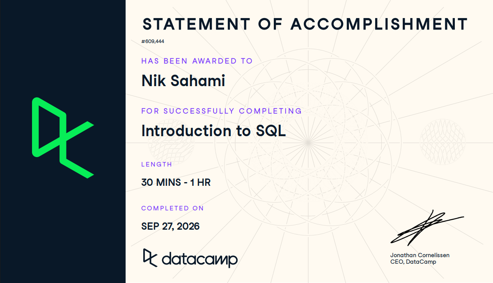

# Course Completion Evidence

## Screenshot of Completion

{fig-align="center"}

## When I Completed the Course

# Learning Notes and Takeaways

## Meet Databases and SQL

SQL – Structured Query Language

Query = a piece of SQL code

- Asks for specific information and the database sends back the results

SQL is designed for working with data. That makes it simpler to learn than other programming languages

Database – A system for storing data, finding info in it, and managing it

- Power the applications and websites we use daily

- Support analysis and reporting

  - Use stored data to create reports and analyze trends

Relational Database – data is organized into tables that each cover a different thing or event

- In this example (based on school enrollment data), each row represents a specific class and each column represents a kind of detail about the course. They use course_title, category, price, instructor_name, etc.

Databases can support millions or billions of rows

- Better when data is large or many users and apps need to work with it

## Write Your First SQL

``` sql
SELECT *
FROM courses;
```

Is an example of an SQL query using the SQL keywords of `SELECT` and `FROM`

- SQL Keywords are special words used to give instructions

- `SELECT *` asks for every column, and `FROM` courses tells the database which table to read

  - Instead of the `*` , you can request a specific column

    - Ie. `SELECT course_title`

``` sql
SELECT course_id,
  course_title,
  enrolled_students
FROM courses;
```

This selects the three listed columns in order from the courses table

Adding the `ORDER BY` keyword can arrange the data

- SQL automatically sorts lowest to highest, but you can add `DESC` after to reverse it

``` sql
SELECT course_id,
  course_title,
  enrolled_students
FROM courses
ORDER BY enrolled_students DESC;
```

You can use `LIMIT` to only return aa number of rows. Ie. `LIMIT 10` will only return the top 10 rows

Running a `SELECT` query does not update the original data, it just pulls from it

- Query results are temporary snapshots of the data. To keep results for later use, you must save them to your computer or cloud storage

SQL requires precise syntax, and small mistakes can prevent queries from running

## Complete Your SQL Foundation

The `DISTINCT` keyword after `SELECT` removes duplicates from the selected column:

``` sql
SELECT DISTINCT category
FROM courses;
```

The keywords do not need to all be uppercase for the database to accept them, it just makes it easier to read

Include `AS` to rename the new selected column

- It does not rename the actual database column itself

``` sql
SELECT DISTINCT category AS unique_categories
FROM courses;
```

`snake_case` is a naming convention that uses all lowercase and underscores instead of spaces

There are many types of SQL that systems such as PostgreSQL, MySQL, SQL Server, and BigQuery can use

- They are mostly the same but some have small differences in syntax

  - for example, many use `LIMIT 10`, while SQL Server uses `SELECT TOP(10)`

database server – the computer that stores and runs the database

database client – software on your computer that sends queries and receives results

client-server architecture – multiple clients connecting to the same server at once

SQL Client – used to write and run SQL

- could be a web app like BigQuery Console or a desktop app like DBeaver

The SQL you write stays the same regardless of the client used

Traditional database – requires server address, username, password, and database name in order to connect

- at organizations these are provided by the admin

cloud database - access depends on the service and the organization’s setup

# Reflection and Future Reference

# Appendix

## GitHub Repo

<https://github.com/itsnik1/ibm-6500-sql-learning-portfolio/>

## GitHub Pages Published Link
